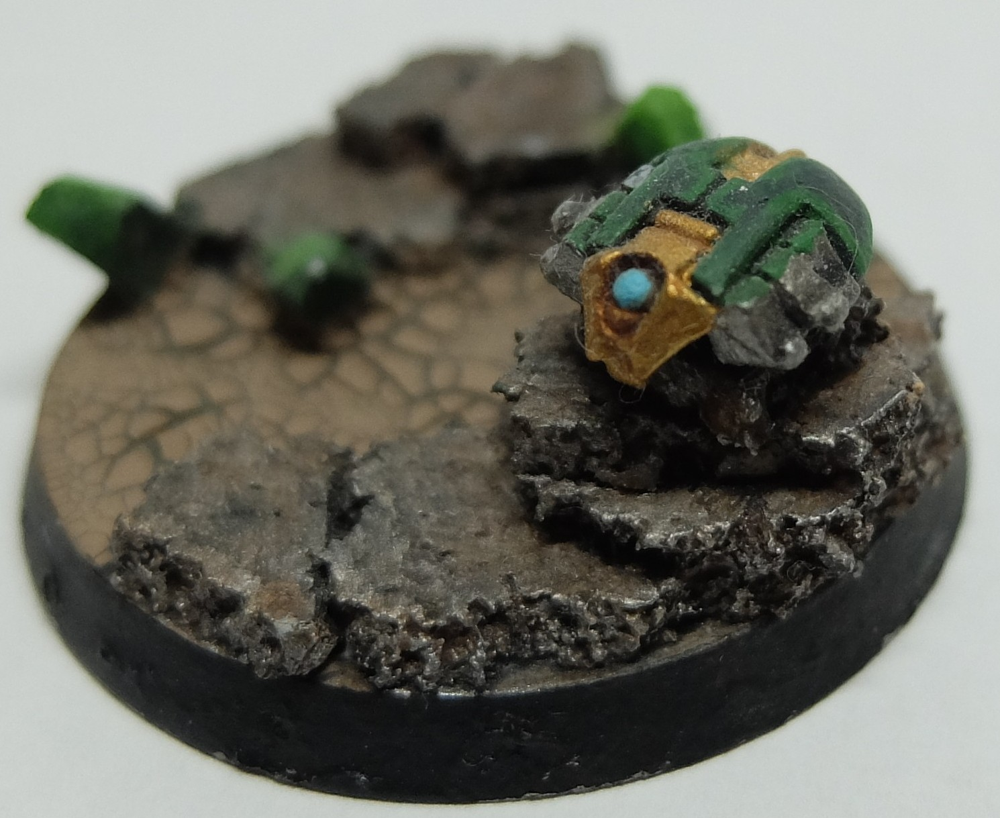

+++
title = "About"
menu = "main"
weight = 1
+++

# About

Hi! I'm Peperonchinoo (real name not being used for obvious reasons). I was inspired to start a blog by [Sproket's Small World](https://sproketsmallworld.blogspot.com/), a site dedicated to painting miniatures. As I have recently begun painting again, I thought it would be nice to **1**. document my journey so I could look back and see if I've improved, and **2**. possibly share my own thoughts on random things so that I or whoever cares to in the future may get some insight into who I am. But mostly I'm here for reason 1.

Some brief background: I started reading Warhammer 40,000 books somewhere in 5th grade, when a friend's older brother introduced me to the universe. Our school library (for whatever reason) carried WH40K books, and I ended up getting pretty into the setting for a few years. But I didn't actually buy my first miniature until I was in 8th grade, where I picked up a Start Collecting Necrons set at a local GW store, and I didn't actually buy any paint until something like 10th grade. At this point I painted very sparingly, and was much more focused on playing video games (and probably school/getting into college), and the hobby never really took off for me. Now in 2025 I am a graduate student, and still have a very limited amount of time to pursue any hobbies. However, I am much less interested in video games! And so in searching for new hobbies, I decided to revisit WH40K and painting.

Here is an image of the first miniature I ever painted! It is 1/3rd of a scarab swarm :) and I lost everything else :).

