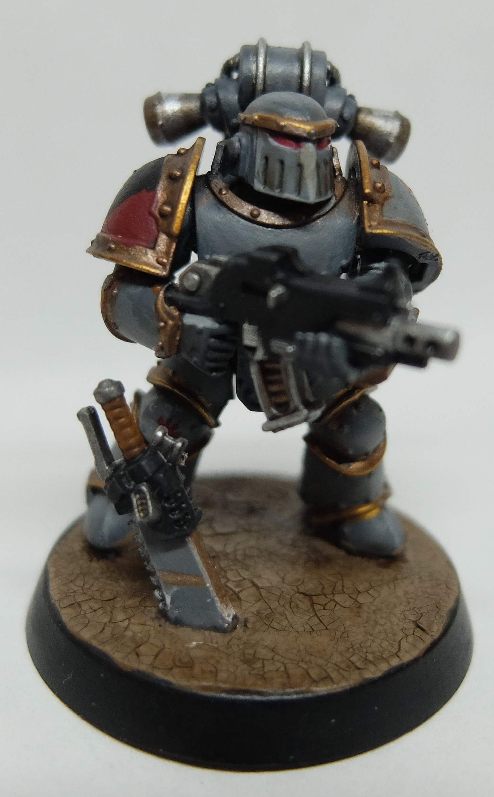
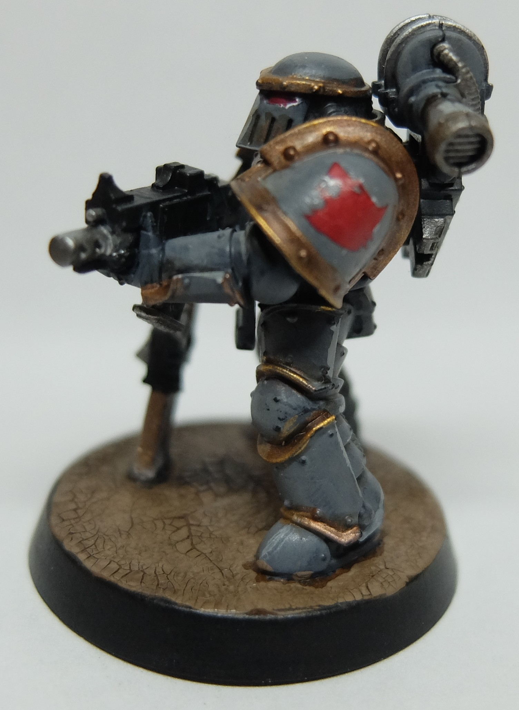
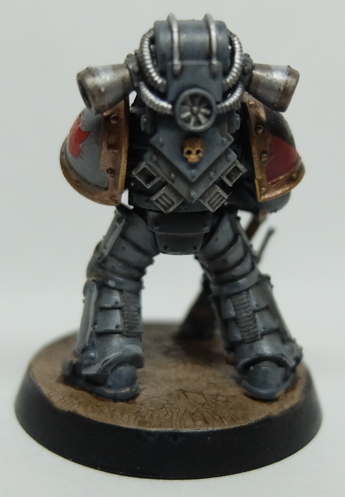
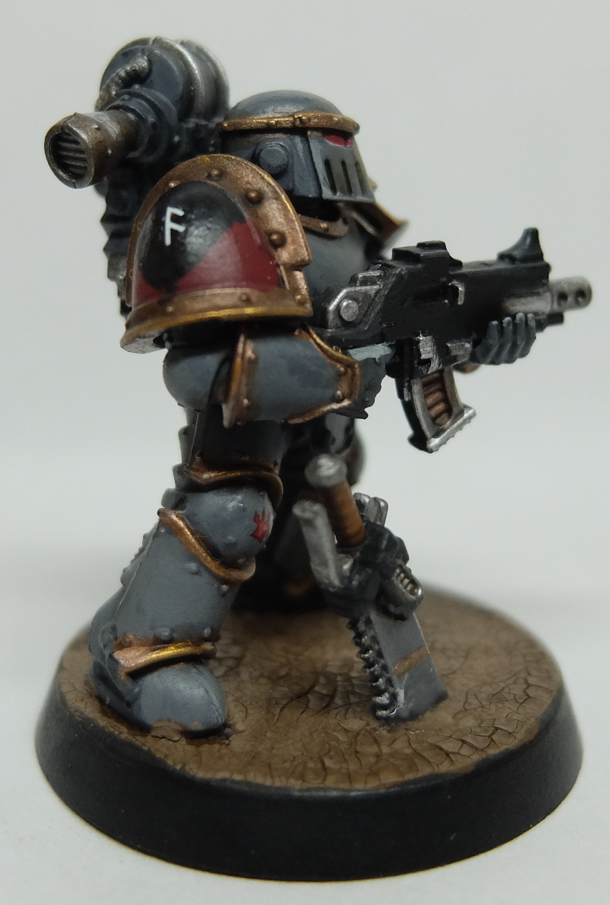

+++
title = "My first miniature in a long, long time"
date = "2025-06-20"
description = "Discussing my first miniature in ~8 years!"
tags = [
    "first",
    "miniature",
    "pre-heresy",
    "space wolves",
]
+++

As I was deciding to get back into painting WH40K (or miniatures in general), the obvious first question I had to ask myself was what I was going to paint first. If I were just starting out completely fresh in the hobby, this decision would also involve agonizing over which faction I liked or thought looked the most interesting. Generally speaking, I think I like Necrons and various Chaos Space Marines. I'm not terribly picky though, I don't really intend to play the tabletop board game, I just enjoy the hobby aspect of painting (and potentially kitbashing/converting/sculpting if I get there). As such, I was thinking of picking up a necron combat patrol... but was reminded that in high school, I had bought a couple of box sets that had always just sat unpainted.

This seemed to me like a great opportunity to get through a bit of my backlog/pile of shame and also get some practice painting again, on models that I didn't care *too* much about if I gave them a poor paintjob. So I cracked open my Burning of Prospero box; there are a lot of minis in here, including standard pre-heresy space marine legionaries in Mark III armor, Tartaros pattern terminators, Custodes, and Sisters of Silence. There are also two named figures, Geigor Fell-Hand for the Space Wolves and pre-heresy Ahriman (my goat) for the Thousand Sons. So a lot of variety, with the added benefit that if I were to finish painting the box, I'd have the ability to play a standalone game if I so desired.

Given that the MkIII legeionaries were the most numerous model, I decided I would start painting with those, and I felt I should start painting the Space Wolves side first because I wanted the Thousand Sons to look as good as I could possibly get them (a bit of favoritism). Luckily while Duncan was still at GW, he produced a [good tutorial](https://www.youtube.com/watch?v=-cAB8UsSSos) on how to paint these exact miniatures! I bought the range of paints he uses in the video, a couple brushes from the Army Painter, and made a wet palette.

I painted this guy a couple weeks before I decided to make this blog post and thus have no progress pictures. But I think for a first try in a long, long time, I did reasonably well. The only place I differed from the guide was on the gold/brass areas; instead of highlighting with Sycorax Bronze, I chose to highlight with the warmer Gehenna's Gold. For the skull on the backpack, I just did a base of Balthasar Gold and highlight/layer of Sycorax Bronze.

   

For my base, I painted the base Mournfang Brown before adding Agrellan Earth. Once that dried, I washed with Agrax Earthshade to darken it and give the cracks some more depth. I then applied Lahmian Medium over everything to protect the paint.

There are some areas where the paint isn't so neat, and when assembling this specific mini I had a lot of trouble getting the chainsword onto the back where it is supposed to go. To get around that I just cut it into two and had it sticking out of the ground, although I had to scrape off the crackle paint and couldn't convince plastic glue to hold, so I used superglue. Unfortunately I don't have a fine applicator so the blob of glue crept around and part of the sword looks a little fogged as a result. This chainsword also isn't actually meant to have both sides be visible, so the back of the handle area looks a little funky (but thankfully you can't see it too well due to the angle). I also struggled on the eyes, I was going for a more glowy effect but the Khorne Red went on a little too strong.

Paint list (all Citadel)
Chaos Black Spray
Mechanicus Standard Grey
Dawnstone
Administratum Grey
Balthasar Gold
Sycorax Bronze
Leadbelcher
Stormhost Silver
Abaddon Black
Khorne Red
White Scar
